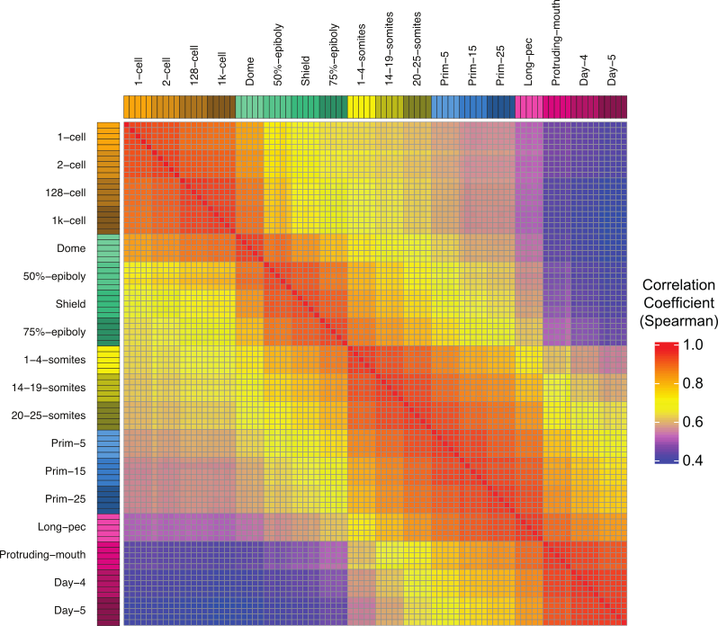
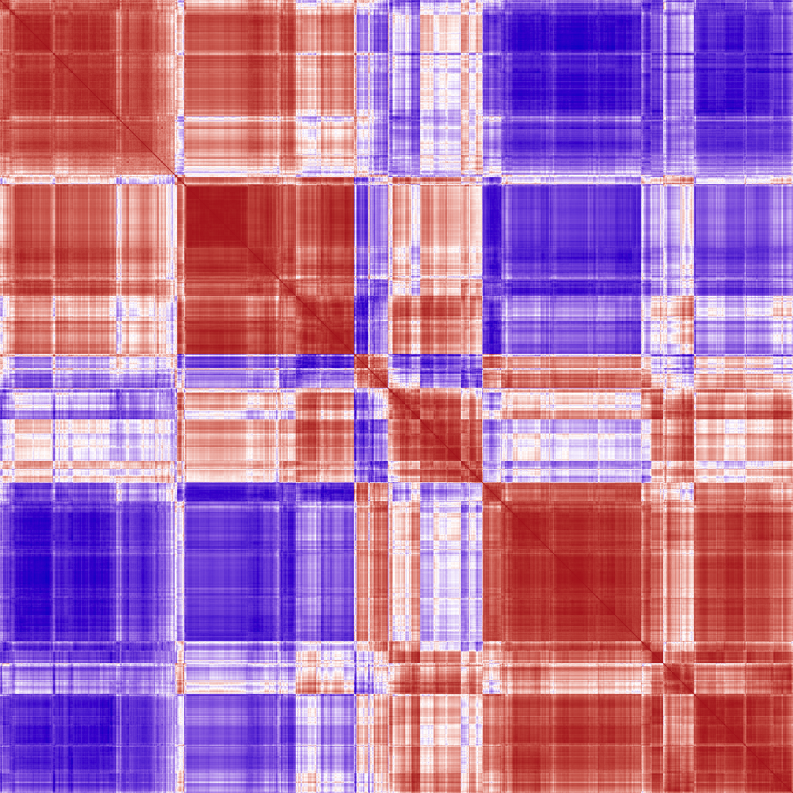
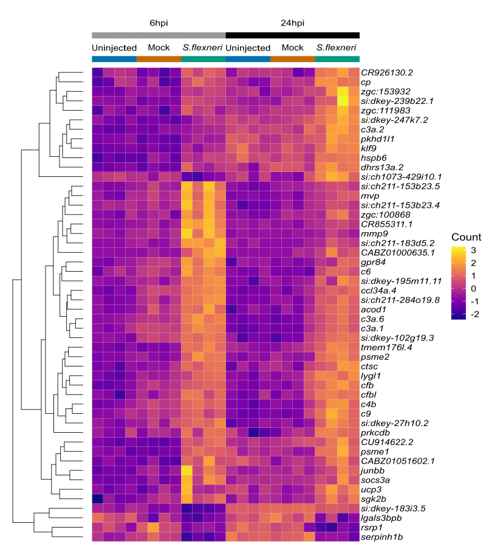

I am a bioinformatician in the Busch Lab at Queen Mary University of London and have a PhD in developmental biology from the University of London.

After my PhD, I travelled to California to work in the lab of Tom Schilling at the University of California, Irvine. I spent 5 years working on retinoic acid signalling in zebrafish development and trying to learn to surf.

In 2011, I made the switch from wet lab to bioinformatics and joined the Zebrafish Mutation Project at the Wellcome Sanger Institute. Since then, I have worked on software to automate CRISPR/Cas9 experiments and large scale RNA-seq studies on early zebrafish and mouse development.

I write in R, Python and Perl and I love making plots.

::: {#example-plots style="background-color: #FFFFFF;"}

```{r images, fig.show = "hold", out.width = "30%", fig.align = "default", echo = FALSE}







```
:::
