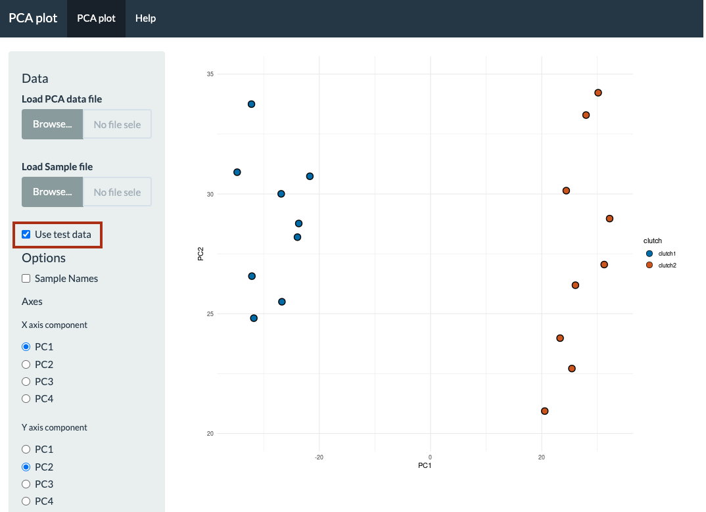
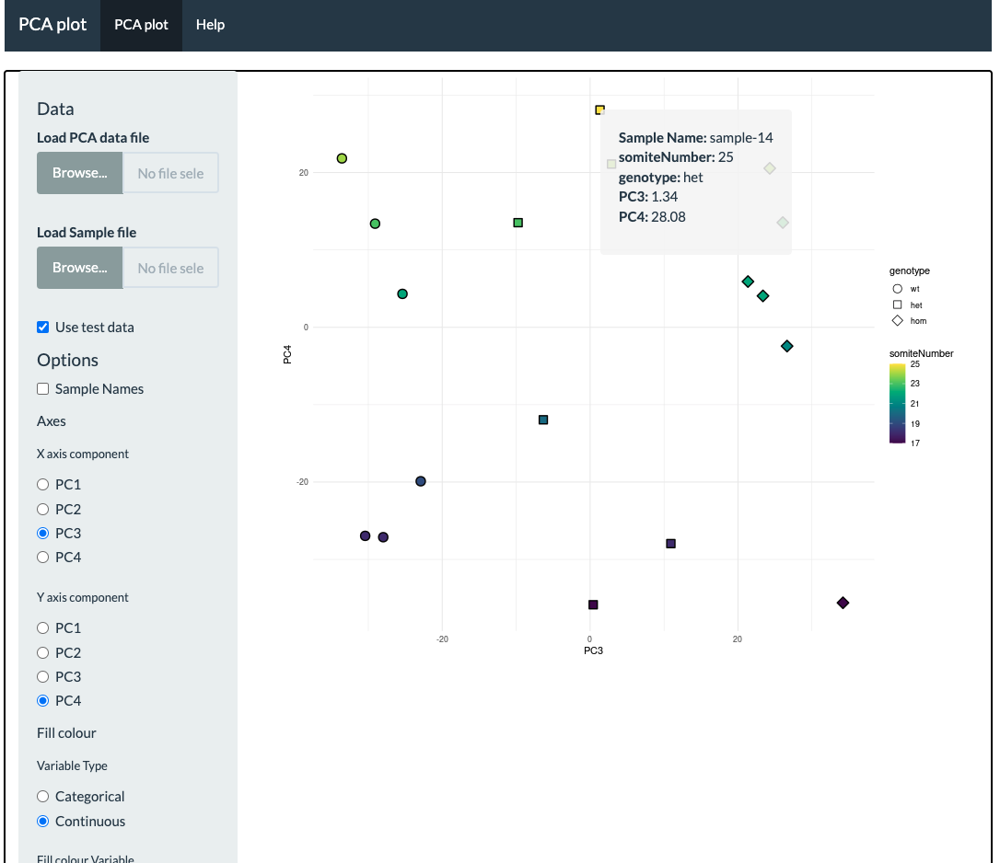
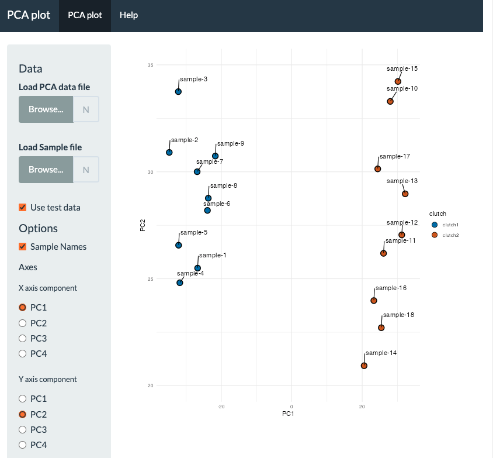
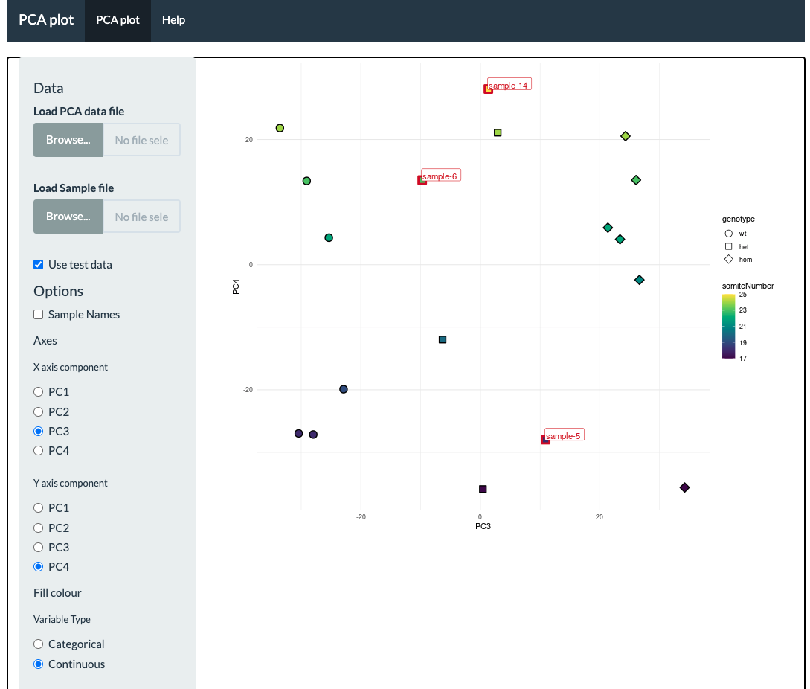
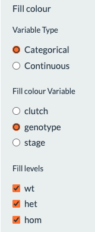
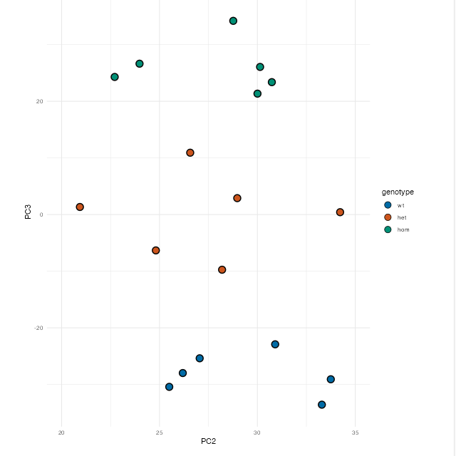

```{r}
#| label: packages
#| message: false
#| echo: false
library(knitr)
library(tidyverse)
```

This is a Shiny app that I made to view the results of Principal Component 
Analysis (PCA) on RNA-seq data.
You can try it out on [shinyapps.io](https://richysix.shinyapps.io/pca_plot)

Principal Component Analysis (PCA) is often used as one way of assessing the 
results of an RNA-seq experiment. It is a method to project high dimensional 
data onto a smaller number of components that are a linear combination of the 
orginal features. A better description can be found [here](https://www.nature.com/articles/nmeth.4346). 

It is often useful to see patterns within samples from an RNA-seq experiment.
I made this Shiny app to allow people to explore the results of a PCA from an
RNA-seq experiment by choosing which components to plot against each other and 
how to display sample metadata using colour and shape.

It uses two inputs files. A PCA data file and a sample metadata file.

## PCA file 

The first column should be an identifier for the samples and the remaining ones
should be the values for the principal components. The column names for the 
components should be of the form PC*number*

For example,
```{r}
#| label: example-pca-data
#| include: true
#| echo: false
# load PCA data
pca_data <- read_tsv('test-pca.tsv', show_col_types = FALSE)
kable(head(pca_data), table.attr = "class=\"table table-light\"", 
      col.names = sub("_", " ", colnames(pca_data)),
      format = "html")
```

## Sample File

The sample file must contain samples ids in the first column that match the 
ids in the first column of the PCA data file. All other columns are optional.

e.g.

```{r}
#| label: example-sample-data
#| include: true
#| echo: false
# load sample data
sample_data <- read_tsv('test-samples.txt', show_col_types = FALSE)
kable(head(sample_data), table.attr = "class=\"table table-light\"", 
      col.names = sub("_", " ", colnames(sample_data)),
      format = "html")
```

## Test Data

There is a checkbox to load some simulated test data.

## PCA plot

The plot defaults are to plot PC1 against PC2 with the first categorical 
variable in the sample data being used as the fill colour for the points.



Hovering over a point brings up a tooltip containing the metadata for that 
sample.



Sample names can be displayed by clicking the **Sample Names** checkbox.



Individual samples can be labelled by clicking on the points.



### Controls

The **X axis component** and **Y axis component** radio buttons let you change 
which components are plotted against each other.

The **Fill colour** controls let you change whether categorical or continuous 
variables are supplied as options for the fill colour and **Fill colour Variable**
radio buttons let you choose which variable is used. If a categorical variable 
is used, the **Fill levels** checkboxes can be used to select which groups of 
samples are shown.

::: {#fill-controls style="background-color: #FFFFFF"}

{width=20%}
{width=75%}

:::

The **Shape** controls allow you to map a categorical variable in the metadata 
to shape. By default nothing is mapped to shape and all the points are circles. 
Only variables that have fewer than 8 levels can be mapped to shape.
The **Shape levels** checkboxes can be used to select which groups of 
samples are shown.

There are also controls for setting the size of the points, the limits of the 
plot and for downloading a copy of the plot either as a image file or as an
.rda file containing an R `ggplot` object
