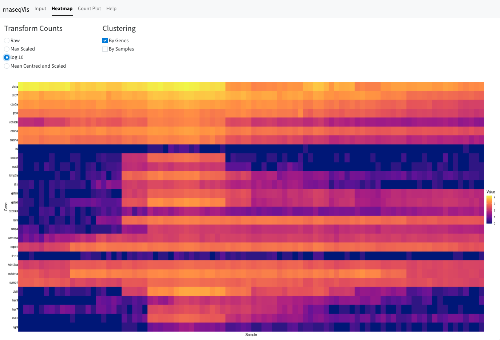
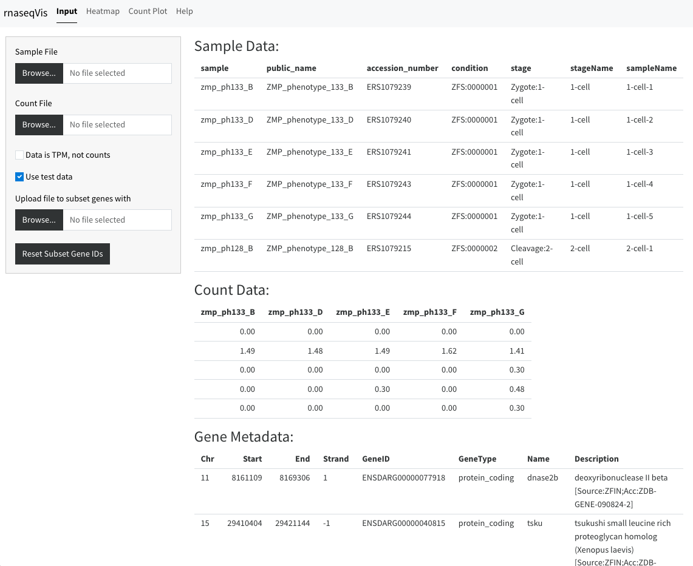
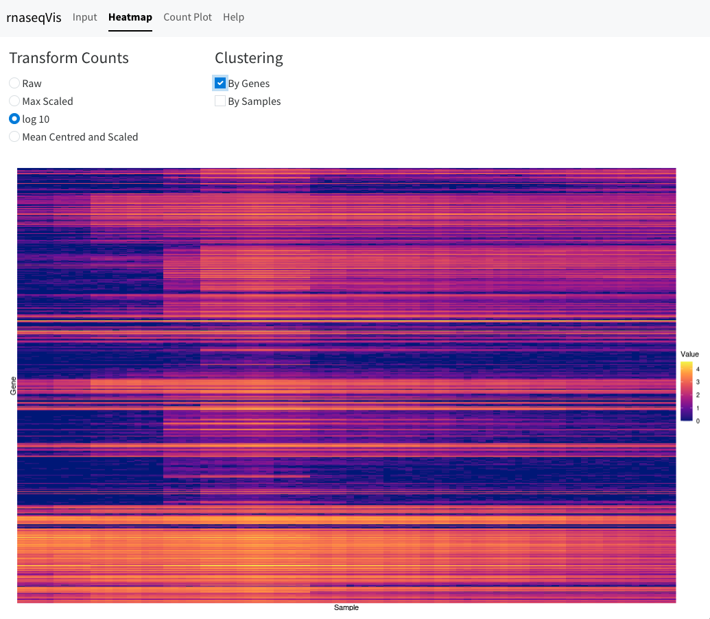
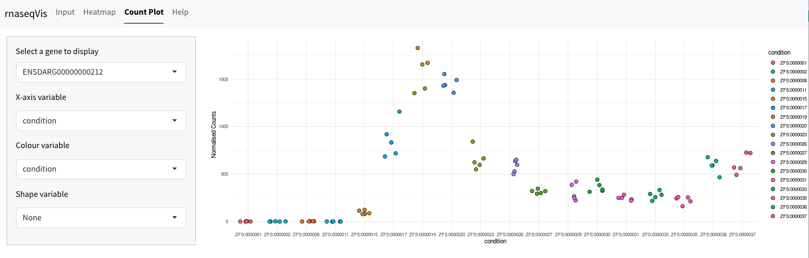

This is a Shiny app that I made for exploring the results of RNA-seq data. It produces 
heatmaps and count plots to show the expresssion levels of groups or individual 
genes. This is a recent update of an older version that I made to learn using 
Shiny modules.
You can try it out on [Posit Connect](https://019658d9-521a-3d9f-fd3f-8d5cd9302c19.share.connect.posit.cloud/)

The app has 4 tabs: Input, Heatmap, Count Plot, and Help

## Help

The help page details the format of the input files and what options can be set.

## Input

The input tab has input for uploading the input data files (sample data and 
count data). It also has checkboxes to use some test data included with the app 
and to indicate that the uploaded data represents Transcripts per Million (TPM) 
not count data. It is also possible to upload a separate file of Ensembl gene 
ids to subset the data to and only display the subset in the heatmap.

{fig.alt="Image of a web page with input boxes on the left and tables of data displayed on the right"}

## Heatmap

The heatmap tab produces a heatmap plot with sample displayed along the X-axis 
and Genes on the Y-axis. The are various options for scaling and clustering the 
data.

{fig.alt="Radio buttons and checkboxes for different scaling and 
clustering options above a gene expression heatmap"}

## Count Plot

This tab allows you to select an individual gene and see a scatterplot showing 
the samples along the X-axis, grouped by a variable in the sample metadata 
(e.g. stage or genotype), with the normalised expression counts on the Y-axis.
If there are categorical variables in the metadata it is also possible to 
indicate that with shapes on the plot.

{fig.alt="A sidebar of pulldown menus for selecting the plot options 
with an x-y scatterplot showing the expression of a gene over time. 
The values peak in the middle of the timeframe"}

