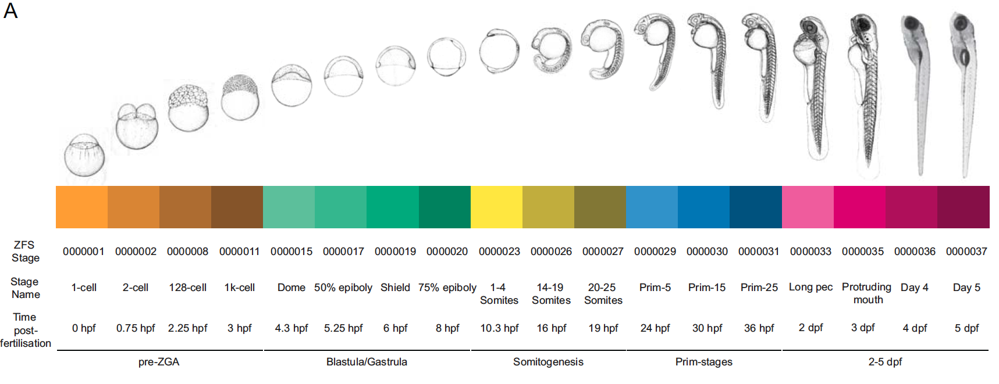

This plot appeared in Figure 1 of 
[A high-resolution mRNA expression time course of embryonic development in zebrafish](https://doi.org/10.7554/eLife.30860)
The code that was originally used to create it can be found in the [github 
repository for the paper](https://github.com/richysix/zfs-devstages). I have 
updated the code to take advantage of newer packages and functions.

The plot shows the correlation in gene expression values between different zebrafish 
samples in a developmental time course. To understand how the levels of genes 
change over embryonic development, we collected zebrafish samples at different 
time points during embryogenesis. We collected 5 samples at 18 time points, 
producing 90 samples overall.



Then we sequenced the RNA of the samples. The sequenced fragments are mapped to 
the reference genome and fragments that map to genes are added up to provide a
count of gene expression for each gene. The counts were converted to Transcripts 
per Million (TPM)
The data can be downloaded from [eLife](https://doi.org/10.7554/eLife.30860.026)
or [Figshare](https://doi.org/10.6084/m9.figshare.29086976)

```{r}
#| label: data
#| warning: false
tpm_file <- "zfs-devstages-tpm.tsv"
if (!file.exists(tpm_file)) {
  tpm_url <- "https://figshare.com/ndownloader/files/54600980"
  download.file(tpm_url, tpm_file)
}

library(tidyverse)
tpm_data <- read_tsv(tpm_file, show_col_types = FALSE) |>
  dplyr::rename(GeneID = e85.Ensembl.Gene.ID)
```

The data looks like this:
```{r}
#| label: show-data
library(knitr)
kable(tpm_data[1:5, 1:13])
```

The first 8 columns are information about each gene. The remaining columns are 
TPM values for each sample.

We also need sample information, which is present in the Github repo.

```{r}
#| label: sample-info
sample_file <- "zfs-rnaseq-sampleInfo.tsv"
if (!file.exists(sample_file)) {
  sample_url <- "https://raw.githubusercontent.com/richysix/zfs-devstages/refs/heads/master/dataFiles/rnaseq/zfs-rnaseq-sampleInfo.tsv"
  download.file(sample_url, sample_file)
}

samples <- read_tsv(sample_file, show_col_types = FALSE) |> 
  # set levels of sampleName
  dplyr::mutate(
    stageName = fct_inorder(stageName),
    sampleName = fct_inorder(sampleName)
  )
```

```{r}
#| label: filtering-data
#| echo: false
#| eval: false
# Filter to genes with non-zero TPM in all replicates at at least one stage
tpm_filtered <- tpm_data |> 
  # get just tpm values and Gene ID
  dplyr::select(-c(Chr:Gene.description)) |>
  # pivot to long format
  tidyr::pivot_longer(cols = -GeneID, names_to = "sampleName") |> 
  # join in stage from sample info
  dplyr::inner_join(dplyr::select(samples, stageName, sampleName),
                    by = join_by("sampleName" == "sampleName")) |> 
  dplyr::group_by(GeneID, stageName) |> 
  dplyr::summarise(above_threshold = all(value > 0)) |> 
  dplyr::summarise(keep = any(above_threshold)) |> 
  dplyr::inner_join(tpm_data, join_by("GeneID" == "GeneID")) |> 
  dplyr::filter(keep) |>
  dplyr::select(-keep)

tpm_orig <- tpm_data
tpm_data <- tpm_filtered
```

The correlation heatmap itself is straight forward. I subset the data to just 
the TPM columns and use the `cor` function to calculate the Spearman[^1] correlation
coefficient between the columns (samples) of the TPM matrix. 

[^1]: I used Spearman, 
because it is less sensitive to outliers. I originally used "Pearson" and the 
reviewers of the paper noticed that some of the later samples appeared to 
correlate better with very early stages than with the immediately prior stages. This 
was because some genes (e.g. ribosomal genes) are very highly expressed at some 
stages and the large values skew the Pearson coefficient to produce spuriously 
high correlation values in some cases. If you remove `method = "spearman"` from the code and 
run it, you can see for yourself. Check out the top right of the matrix.

The only slight change is because the axes start at 0 in the bottom left but 
because of how we want the matix arranged, we need to reverse the order of the 
y-axis variable (`sample_name_2`).

```{r}
#| label: cor-plot-1
sample_cor_spearman <- tpm_data |>
  # remove metadata columns
  dplyr::select(-c(GeneID:Gene.description)) |>
  as.matrix() |>
  # create the sample correlation matrix
  cor(method = "spearman")

sample_cor_spearman_heatmap <- 
  sample_cor_spearman |>
  # create tibble, make rownames a column
  as_tibble(rownames = "sample_name_1") |> 
  # pivot longer
  tidyr::pivot_longer(cols = -sample_name_1, names_to = "sample_name_2") |> 
  # set levels of sample names
  dplyr::mutate(
    sample_name_1 = factor(sample_name_1, levels = samples$sampleName),
    sample_name_2 = factor(sample_name_2, levels = rev(samples$sampleName))
  ) |>
  ggplot() +
  geom_tile(aes(x = sample_name_1, y = sample_name_2, fill = value), colour = "grey60") +
  scale_fill_gradientn(colours = c("blue", "yellow", "red"),
                      guide = guide_colorbar(title = "Correlation\nCoefficient\n(Spearman)") ) +
  theme_void() + 
  theme(legend.position="right", legend.title = element_text(colour="black"))

print(sample_cor_spearman_heatmap)
```

Now to finish the figure, we need to create the coloured sample strips that 
represent individual samples. We wanted a way to identify each stage, but because 
there are 18 different stages, choosing different colours that can be easily 
distinguished is essentially impossible. So I divided the stages into groups and
picked a hue for each group. Then I altered the saturation of the 
colours to create a gradient in each group.

```{r}
#| label: stage-colours
# get hues from colour blind palette
col_hsv <- biovisr::cbf_palette(named = TRUE)[ 
  c("orange", "blue_green", "yellow", "blue", "purple")] |>
  col2rgb() |> 
  rgb2hsv()

colour_palette <- 
  hsv(
    # there's 3 values in groups 3 and 4. This removes one value from each
    h = rep(col_hsv["h",], each = 4)[c(-9,-13)],
    s = c(rep(1, 14), 0.6, rep(1,3)),
    # provide a range for value 
    v = c(seq(1,0.55,-0.15),
          seq(1,0.55,-0.15),
          seq(1,0.55,-0.225),
          seq(1,0.55,-0.225),
          seq(1,0.55,-0.15)
    )
  )
names(colour_palette) <- levels(samples$stageName)

scales::show_col(colour_palette)
```

The sample strip is a heatmap (`geom_tile`) using the samples data frame as the
input data. The x-axis is defined by the sample names making one cell for each 
sample. The fill colours are determined by the `stageName` factor. 

```{r}
#| label: basic-sample-strip
#| fig-height: 3
sample_strip_horiz <- 
  ggplot(data=samples, aes(x=sampleName, y=1, fill=stageName)) + 
  geom_tile(colour = "black") + 
  scale_fill_manual(values = colour_palette)

print(sample_strip_horiz)
```

The labels are done by setting `breaks` in `scale_x_discrete`. 
`samples$sampleName[seq(3,90,5)]` picks the middle sample from each group to 
position the label. The labels are defined by the levels of the `stageName`
variable. The labels are moved to the top by setting `position = "top"` in 
`scale_x_discrete`. `theme_void()` removes the space caused by axis expansion 
and axis titles, ticks and labels. Then the stage labels are returned and 
rotated by
`theme(axis.text.x.top = element_text(angle = 90, colour = "black", hjust = 0))`

```{r}
#| label: sample-strip-horiz
#| fig-height: 3
sample_strip_horiz <- 
  ggplot(data=samples, aes(x=sampleName, y=1, fill=stageName)) + 
  geom_tile(colour = "black") + 
  scale_fill_manual(values = colour_palette) + 
  scale_x_discrete(
    position = "top", 
    breaks = samples$sampleName[seq(3,90,5)],
    labels = levels(samples$stageName)
  ) +
  guides(fill = "none") +
  theme_void() +
  theme(axis.text.x.top = element_text(angle = 90, colour = "black", hjust = 0))

print(sample_strip_horiz)
```

The vertical sample strip is essentially the same as the horizontal one, except
were reorder the `sampleName` variable so that it matches the order of the matrix.

```{r}
#| label: sample-strip-vert
#| fig-width: 3
# rearrange sample levels
set_breaks <- function(x) {
  return(x[seq(3,90,5)])
}

stage_for_sample <- samples$stageName |>
  as.character() |>
  magrittr::set_names(samples$sampleName)

sample_strip_vert <- samples |>
  dplyr::mutate(
    sampleName = factor(sampleName, levels = rev(levels(sampleName))),
    stageName = factor(stageName, levels = rev(levels(stageName)))
  ) |>
  ggplot(aes(x = 1, y = sampleName, fill=stageName)) + 
  geom_tile(colour = "black") + 
  scale_fill_manual(values = colour_palette) + 
  scale_y_discrete(
    breaks = set_breaks,
    labels = stage_for_sample
  ) +
  guides(fill = "none") +
  theme_void() +
  theme(axis.text.y = element_text(colour = "black", hjust = 1))

print(sample_strip_vert)
```

To put it all together, I originally used Adobe Illustrator. 
However, now to put it all together, I can use the `patchwork` package.

```{r}
#| label: composite-1
library(patchwork)

plot_spacer() +
  sample_strip_horiz +
  sample_strip_vert +
  sample_cor_spearman_heatmap +
  plot_layout(ncol = 2, byrow = TRUE, widths = c(1,20), heights = c(1,20),
              guides = "collect")

```

One final thing that needs tweaking is size of the image to make sure the matrix
portion of the plot is square. You could do a process of trial and error to make 
it work but an easier wasy to do this, is to removed the legend 
from the plot with `theme(legend.position = "none")` and the use the 
[`get_legend`](https://rpkgs.datanovia.com/ggpubr/reference/get_legend.html) 
function from the `ggpubr` package to extract the legend from the original plot 
as a separate ggplot object.
Then, I made the final figure 7 inches wide and 6 inches high to provide extra 
space for the legend and scaled the widths and heights in `plot_layout` accordingly.

```{r}
#| label: final-fig
#| fig-width: 7
#| fig-height: 6
sample_cor_spearman_heatmap_no_legend <- 
  sample_cor_spearman_heatmap + theme(legend.position = "none")

heatmap_legend <- ggpubr::get_legend(sample_cor_spearman_heatmap) |>
  ggpubr::as_ggplot()

plot_spacer() + sample_strip_horiz + plot_spacer() +
  sample_strip_vert + sample_cor_spearman_heatmap_no_legend + heatmap_legend +
  plot_layout(nrow = 2, ncol = 3, byrow = TRUE, widths = c(1,17,3), 
              heights = c(1,17), guides = "collect")
```

I made this figure 9 years ago. If I was making it today, I would use a 
different colour scheme. That's because this colour scheme is not perceptually
uniform. 
So, these days I would use the [viridis](https://cran.r-project.org/web/packages/viridis/vignettes/intro-to-viridis.html) 
colour map, which is included in `ggplot2`. We just use `scale_fill_viridis_c`
For an introduction to viridis watch [this video](https://www.youtube.com/watch?v=xAoljeRJ3lU).

```{r}
#| label: viridis
#| fig-width: 7
#| fig-height: 6
sample_cor_spearman_heatmap_viridis <- 
  sample_cor_spearman |>
  # create tibble, make rownames a column
  as_tibble(rownames = "sample_name_1") |> 
  # pivot longer
  tidyr::pivot_longer(cols = -sample_name_1, names_to = "sample_name_2") |> 
  # set levels of sample names
  dplyr::mutate(
    sample_name_1 = factor(sample_name_1, levels = samples$sampleName),
    sample_name_2 = factor(sample_name_2, levels = rev(samples$sampleName))
  ) |>
  ggplot() +
  geom_tile(aes(x = sample_name_1, y = sample_name_2, fill = value), colour = "grey60") +
  scale_fill_viridis_c(guide = guide_colorbar(title = "Correlation\nCoefficient\n(Spearman)"),
                       option = "plasma") +
  theme_void() + 
  theme(legend.position="right", legend.title = element_text(colour="black"))

sample_cor_spearman_heatmap_viridis_no_legend <- 
  sample_cor_spearman_heatmap_viridis + theme(legend.position = "none")

heatmap_legend_viridis <- ggpubr::get_legend(sample_cor_spearman_heatmap_viridis) |>
  ggpubr::as_ggplot()

plot_spacer() + sample_strip_horiz + plot_spacer() +
  sample_strip_vert + sample_cor_spearman_heatmap_viridis_no_legend + heatmap_legend_viridis +
  plot_layout(nrow = 2, ncol = 3, byrow = TRUE, widths = c(1,17,3), 
              heights = c(1,17), guides = "collect")
```
