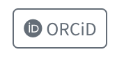

The initial steps are from this YouTube [tutorial](https://www.youtube.com/watch?v=OlvO-EG-P60).

Briefly, I created a new Quarto Blog project in Rstudio, which creates a set of 
template files to start with. I renamed the `index.qmd` file to `blog.qmd` and 
the `about.qmd` file to `index.qmd`. Then I updated the `_quarto.yml` file to 
add a nav bar to the left hand side. And I removed the example blog posts as well.

Once the initial set up was done, I wanted to remove the link to the bin fire that is Twitter and add a link to my [ORCiD](https://orcid.org/0000-0003-1842-412X) page. This has a list of my publications. 
The ORCiD icon is not in the standard bootstrap icons, but is provided in the set of free [FontAwesome](https://fontawesome.com/search?q=orcid&o=r&ic=free) icons. 
So I installed the Quarto [Font Awesome extension](https://github.com/quarto-ext/fontawesome)

```
quarto add quarto-ext/fontawesome
```

The ORCiD logo is in the brands set, so the shortcode for it is:

```markdown
{}
```

A slight wrinkle is that instead of using the icon key as in the github and twitter examples, you need to use the text key, as explained [here](https://github.com/quarto-dev/quarto-cli/discussions/7640).

So the yaml looks like this:
```markdown
    - text: "{} ORCiD"
      href: https://orcid.org/0000-0003-1842-412X
```

And the button looks like this: 

